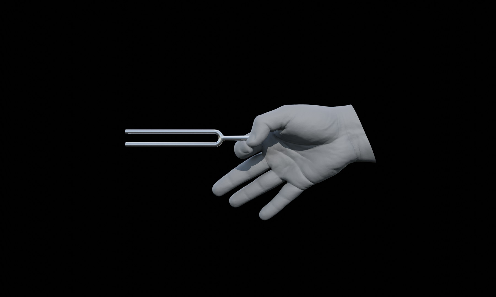

# Hello World! experiments
This week we learned the basics of html structure, some basic tags and some basic styling.
## Two different basic pages showing various tags and styles
### #1 rendered page '[STACKED DIVS](https://karenanndonnachie.github.io/CODEWORDS2024/WEEK1/)'
<body>
<div align="center">

<h1>Hello World!</h1>
</div>
</body>

### #1 html code
````
<!DOCTYPE html>
<html lang="en">
<head>
<meta charset="UTF-8" />
<meta name="viewport" content="width=device-width, initial-scale=1.0" />
<title>Codewords</title>
</head>
<body>
<div align="center">

<h1>Hello World!</h1>
</div>
</body>
</html>
````
### #2 rendered page '[INLINE IMAGE](https://karenanndonnachie.github.io/CODEWORDS2024/WEEK1/inline.html)'
<body>
<div align="center">
<h1>Hello  World!</h1>
</div>
</body>

### #2 html code
````
<!DOCTYPE html>
<html lang="en">
<head>
<meta charset="UTF-8" />
<meta name="viewport" content="width=device-width, initial-scale=1.0" />
<title>Codewords</title>
</head>
<body>
<div align="center">
<h1>Hello  World!</h1>
</div>
</body>
